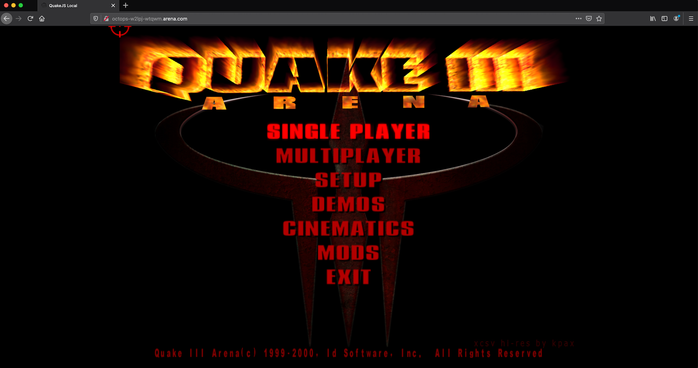
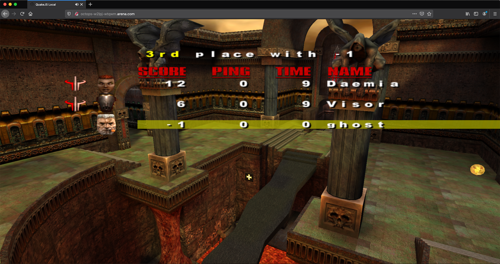
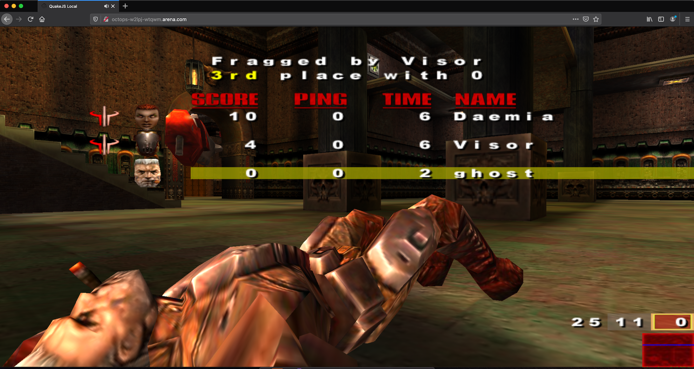

# Gameserver Ingress Controller
Automatic Ingress configuration for Game Servers managed by [Agones](https://agones.dev/site/).

The Gameserver Ingress Controller leverages the power of the [Kubernetes Ingress Controller](https://kubernetes.io/docs/concepts/services-networking/ingress-controllers/) to bring inbound traffic to dedicated game servers.

Players will be able to reach out to a dedicated game server using a custom domain and a secure connection. I.e.:`https://octops-2dnqv-jmqgp.mygame.com`

## Supported Agones Resources
- Fleets
- Stand-Alone GameServers

## How it works
When a gameserver is created by Agones, either as part of a Fleet or a stand-alone deployment, the gameserver ingress controller will handle the provisioning of a couple of resources.

It will use the information present in the gameserver annotations and metadata to create the required Ingress and dependencies.

As an example, a Fleet that looks like:
```yaml
apiVersion: "agones.dev/v1"
kind: Fleet
metadata:
  name: octops
  labels:
    cluster: gke-1.17
    region: us-east-1
spec:
  replicas: 3
  template:
    metadata:
      labels:
        cluster: gke-1.17
        region: us-east-1
      annotations:
        # Required annotation used by the controller
        octops.io/gameserver-ingress-domain: "mygame.com"
        octops.io/terminate-tls: "true"
        octops.io/issuer-tls-name: "letsencrypt-prod"
 ...
```

Deployed Gameservers:
```bash
NAME                 STATE   ADDRESS         PORT   NODE     AGE
octops-2dnqv-jmqgp   Ready   36.23.134.23    7437   node-1   10m
octops-2dnqv-d9nxd   Ready   36.23.134.23    7323   node-1   10m
octops-2dnqv-fr8tx   Ready   212.76.142.33   7779   node-2   10m
```

Ingresses created by the controller:
```bash
NAME                 HOSTS                           ADDRESS         PORTS     AGE
octops-2dnqv-jmqgp   octops-2dnqv-jmqgp.mygame.com                   80, 443   4m48s
octops-2dnqv-d9nxd   octops-2dnqv-d9nxd.mygame.com                   80, 443   4m46s
octops-2dnqv-fr8tx   octops-2dnqv-fr8tx.mygame.com                   80, 443   4m45s
```

List of Ingresses and Backends
```bash

https://octops-2dnqv-jmqgp.mygame.com/ ⇢ octops-2dnqv-jmqgp:7437
https://octops-2dnqv-d9nxd.mygame.com/ ⇢ octops-2dnqv-d9nxd:7323
https://octops-2dnqv-fr8tx.mygame.com/ ⇢ octops-2dnqv-fr8tx:7779
```

## Conventions
The table below shows how the information from the gameserver is used to compose the ingress settings.

| Gameserver                          | Ingress       |
| ----------------------------------- |:-------------:|
| name                                | hostname      |
| annotation: octops.io/gameserver-ingress-domain | domain |
|annotation: octops.io/terminate-tls | terminate TLS |
|annotation: octops.io/issuer-tls-name| name of the issuer |

## Clean up and Gameserver Lifecycle
Every resource created by the controller is attached to the gameserver itself. That means, when a gameserver is deleted from the cluster all its dependencies will be cleaned up by the Kubernetes garbage collector.
Manual deletion of services and ingresses is not required by the operator of the cluster.

## Requirements
The following components must be present on the Kubernetes cluster where the dedicated gameservers, and the controller will be hosted/deployed.

- [Agones](https://agones.dev/site)
  - https://agones.dev/site/docs/installation/install-agones/helm/
- [NGINX Ingress Controller](https://kubernetes.github.io/ingress-nginx/)
  - Choose the appropriate setup depending on your environment, network topology and cloud provider. It will affect how the Ingress Service will be exposed to the internet.
- [Cert-Manager](https://cert-manager.io/docs/)
  - Check https://cert-manager.io/docs/tutorials/acme/http-validation/ to understand which type of issuer you should use. 
  - Make sure you have an `Issuer` that uses LetsEncrypt. You can find some examples on [deploy/cert-manager](deploy/cert-manager).
  -  ```$ kubectl apply -f https://github.com/jetstack/cert-manager/releases/download/v1.1.0/cert-manager.yaml```
  
## Fleet and GameServer Manifests
The same configuration works for Fleets and GameServers. Add the following annotations to your manifest:
```yaml
annotations:
  octops.io/gameserver-ingress-domain: "mygame.com"
  octops.io/terminate-tls: "true"
  octops.io/issuer-tls-name: "selfsigned-issuer"
```

- **octops.io/gameserver-ingress-domain:** name of the domain to be used when creating the ingress. This is the public domain that players will use to reach out to the dedicated game server.
- **octops.io/terminate-tls:** it determines if the ingress will terminate TLS. If set to "false" it means that TLS will be terminated at the loadbalancer. In this case there won't be a certificated issued by the local cert-manager.
- **octops.io/issuer-tls-name:** required if `terminate-tls=true`. This is the name of the issuer that cert-manager will use when creating the certificate for the ingress.

## Deploy the Gameserver Ingress Controller

Deploy the controller by running:
```bash
$ kubectl apply -f deploy/install.yaml
```

Check the deployment:
```bash
$ kubectl -n octops-system get pods

# Expected output
NAME                                         READY   STATUS    RESTARTS   AGE
octops-ingress-controller-6b8dc49fb9-vr5lz   1/1     Running   0          3h6m
```

Check logs:
```bash
$ kubectl -n octops-system logs -f $(kubectl -n octops-system get pod -l app=octops-ingress-controller -o=jsonpath='{.items[*].metadata.name}')
```

## Extras

You can find examples of different issuers on the [deploy/cert-manager](deploy/cert-manager) folder. Make sure you update the information to reflect your environment before applying those manifests.

For a quick test you can use the [examples/fleet.yaml](examples/fleet.yaml). This manifest will deploy a simple http gameserver that keeps the health check and changes the state to "Ready".
```bash
$ kubectl apply -f examples/fleet.yaml

# Find the ingress for one of the replicas
$ kubectl get ingress
NAME                 HOSTS                           ADDRESS         PORTS     AGE
octops-tl6hf-fnmgd   octops-tl6hf-fnmgd.mygame.com                   80, 443   67m
octops-tl6hf-jjqvt   octops-tl6hf-jjqvt.mygame.com                   80, 443   67m
octops-tl6hf-qzhzb   octops-tl6hf-qzhzb.mygame.com                   80, 443   67m

# Test the public endpoint
$ curl https://octops-tl6hf-fnmgd.mygame.com

# Output
{"Name":"octops-tl6hf-fnmgd","Address":"36.23.134.23:7318","Status":{"state":"Ready","address":"192.168.0.117","ports":[{"name":"default","port":7318}]}}
```

# Demo

To demonstrate how the `gameserver-ingress-controller` workers, you can deploy a fleet of Quake 3 servers (QuakeKube) that can be managed by Agones.

> QuakeKube is a Kubernetes-ified version of QuakeJS that runs a dedicated Quake 3 server in a Kubernetes Deployment, and then allow clients to connect via QuakeJS in the browser.

The source code of the project that integrates the game with Agones can be found on https://github.com/Octops/quake-kube. 

It is a fork from the original project https://github.com/criticalstack/quake-kube.

## Deploy the Quake Fleet

Update the fleet annotation and use a domain that you can point your Loadbalancer or Public IP.
```yaml
annotations:
  octops.io/gameserver-ingress-domain: "yourdomain.com" # Do no include the host part. The host name will be generated by the controller and it is individual to each gameserver.
```

Deploy the manifest
```bash
$ kubectl apply -f examples/quake/quake-fleet.yaml
```

When the game becomes `Ready` the `gameserver-ingress-controller` will create the Ingress that holds the public URL. Use the following command to list all the ingresses.

```bash
$ kubectl get ingress

# Output
NAME                 HOSTS                                ADDRESS         PORTS     AGE
octops-w2lpj-wtqwm   octops-w2lpj-wtqwm.yourdomain.com                    80, 443   18m
```

Point your browser to the address from the `HOST` column. Depending on your setup there may be a warning about certificates.

Destroy

You can destroy the quake fleet running:
```bash
$ kubectl destroy -f examples/quake/quake-fleet.yaml 
```

As expected Agones will destroy the Fleet, consequently deleting all the Ingresses associated to the destroyed gameservers. 


## Screenshots





